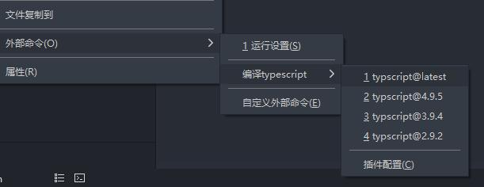
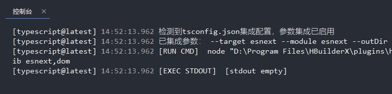

> 编译ts文件

## 使用方式

### 编译单个文件

> 右键 > 外部命令 > 编译typescript > typescript@<版本号> 选择编译要使用的版本



正常运行结束后，会显示`[EXEC STDOUT]  [stdout empty]`



> *不知道为什么微信截图糊了个糊，凑活看吧*

## 关于tsconfig.json

### 集成tsconfig到运行命令参数

> 默认tsc是不允许同时指定入口文件和tsconfig的（`When input files are specified on the command line, tsconfig.json files are ignored.`）

如果需要在运行时集成tsconfig的compilerOptions到命令行参数中，可以在项目package.json中配置

```json
{
    "hxPluginConfig": {
        "hx-compile-typescript": {
            "integrateCompilerOptions": true
        }
    }
}
```

